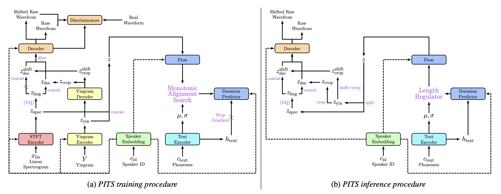
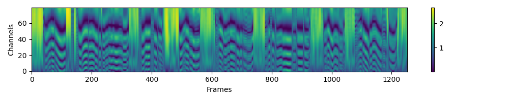

# PITS(44100Hz 日本語対応版)
**PITS: Variational Pitch Inference without Fundamental Frequency for End-to-End Pitch-controllable TTS**

このリポジトリは、 44100Hzの日本語音声を学習および出力できるように編集した[PITS](https://github.com/anonymous-pits/pits)です。初期状態ではベクトル量子化処理無しのPITS(A+D)版ですが、models.pyのfor Q optionと記載されている部分のコードを数行変更すれば、PITS(A+D+Q)版へと変更が可能です。

 

## 1. 環境構築
Anacondaによる実行環境構築を想定します。

1. Anacondaで"PITS"という名前の仮想環境を作成する。[y]or nを聞かれたら[y]を入力する。
    ```sh
    conda create -n PITS python=3.8     
    ```
1. 仮想環境を有効化する。
    ```sh
    conda activate PITS 
    ```
1. このリポジトリをクローンする（もしくはDownload Zipでダウンロードする）
    ```sh
    git clone  # このリポジトリをダウンロード
    cd PITS_44100_JA # フォルダ移動
    ```
1. [PyTorch.org](https://pytorch.org/)より、自分の環境に合わせてPyTorchをインストールする
    ```sh
    # OS=Linux, CUDA=11.7 の例
    pip3 install torch torchvision torchaudio 
    ```
1. その他、必要なパッケージをインストールする。
    ```sh
    pip install -r requirements.txt 
    ```
1. Monotonoic Alignment Searchをビルドする。
    ```sh
    cd monotonic_align
    mkdir monotonic_align
    python setup.py build_ext --inplace
    ```
## 2. データセットの準備
[JVSコーパス](https://sites.google.com/site/shinnosuketakamichi/research-topics/jvs_corpus)による、parallel100(話者間で共通する読み上げ音声 100 発話)、及びnonpara30(話者間で全く異なる読み上げ音声 30 発話)の学習を想定します。

1. [こちら](https://sites.google.com/site/shinnosuketakamichi/research-topics/jvs_corpus)からJVSコーパスをダウンロード&解凍する。
1. 発話音声ファイルのサンプリングレートを44100Hzに変更する。path/to/〜となっている部分は適宜変更する。
    ```sh
    python3 ./dataset/preprocess.py --folder_path path/to/jvs_ver1/ --sampling_rate 44100
    ```
    
    > ⚠path/to/jvs_ver1/ には、jvsコーパスの各話者の発話フォルダ[jvs001,jvs002, ... ,jvs100]が格納されているフォルダパスを指定する。

## 3. [configs](configs)フォルダ内のjsonを編集
主要なパラメータを下表に記載します。

| 分類  | パラメータ名      | 説明                                                                                       |
|:-----:|:-----------------:|:------------------------------------------------------------------------------------------:|
| train | log_interval      | 指定ステップ毎にロスを算出し記録する                                                       |
| train | eval_interval     | 指定ステップ毎にモデル評価を行う                                                           |
| train | save_interval     | 指定ステップ毎にモデル保存を行う                                                           |
| train | epochs            | 学習データ全体の学習回数                                                                   |
| train | batch_size        | 一回のパラメータ更新に使用する学習データの数                                               |
| data  | data_path         | jvs話者フォルダが格納されているフォルダパス（preprocess.pyで使用したpath/to/jvs_ver1/の値）|
| data  | training_files    | 学習用filelistのテキストパス                                                               |
| data  | validation_files  | 検証用filelistのテキストパス                                                               |
| data  | speakers          | 話者名のリスト                                                               |

config_ja_44100.yaml内の、data部分のdata_pathの値を、「2. データセットの準備」部分のpreprocess.pyに使用したjvsフォルダパスに書き換えます。

## 4. 学習
44100HzでのPITS(A+D)版の学習を想定します。Terminalに以下を入力し、学習を開始する。path/to/〜となっている部分は適宜変更する。
```sh
python3 train.py --config ./configs/config_ja_44100.yaml --model PITS_A+D 
# 途中から学習を開始する場合は、--resume path/to/checkpoint.pt を追加する 
```
このとき、nonpara30について、書き起こし文(transcripts_utf8.txt)と実際に格納されているwavファイルが一致しないものは除外する処理が入っています。

学習経過はターミナルにも表示されるが、tensorboardを用いて確認することで、生成音声の視聴や、スペクトログラムやYingramや各ロス遷移を目視で確認することができる。
```sh
tensorboard --logdir ./logs/PITS_A+D/
```

## 5. 推論
推論を行う場合は、Terminalに以下を入力する。path/to/〜となっている部分は適宜変更する。
```sh
python3 inference.py --config path/to/config.yaml --model PITS_A+D --model_path path/to/checkpoint.pth
```
Terminalにて、話者名や、読み上げテキスト、ピッチシフト数（整数）を入力することで、音声が生成さされます。音声は自動的に再生され、infer_logsフォルダ（存在しない場合は自動作成）に保存されます。

## 6.ファインチューニング
1. ファインチューニング用のfilelist等を作成する必要があります。
./filelist/*.txtの中身を参考に作成してください。形式としては、以下のようになっています。
    ```sh
    話者フォルダからwavファイルまでのパス　|　発話テキスト　|　話者名
    ```
2. config.yaml内のtraining_filesと、validation_filesのパスを、作成したリストに書き換えます。
3. config.yaml内のspeakers部分に、話者名を記載（追加でも変更でも良い）する。
5. Terminalに以下を入力し、ファインチューニングを実行する。path/to/〜となっている部分は適宜変更する。
    ```sh
    python3 train.py --config path/to/config.yaml --model PITS_A+D_finetune --force_resume path/to/checkpoint.pt
    ```

## 事前学習モデル
JVSコーパスをxxx Batch、xxx Epoch程度学習した程度のモデルです。喋ったりピッチを変更する程度には問題ないとは思いますが、**学習不足である**ことに注意して使用してください。

**ダウンロード：**

## 付録(Yingramの可視化)
>Yingram, an acoustic feature inspired by [YIN algorithm [22]](http://audition.ens.fr/adc/pdf/2002_JASA_YIN.pdf) that captures pitch information including harmonics.Yingram is designed to address the limitations of extracting f0, which is not well-defined in some cases [[23]](https://arxiv.org/abs/1910.10235), and the Yingram-based model shows better preference than the f0-based model [[16]](https://arxiv.org/abs/2110.14513).
>> DeepL : Yingramは、[YINアルゴリズム[22]](http://audition.ens.fr/adc/pdf/2002_JASA_YIN.pdf)にインスパイアされた音響特徴で、倍音を含むピッチ情報を捉えます。Yingramは、場合によってはうまく定義できないf0を抽出する限界に対処するために設計され[[23]](https://arxiv.org/abs/1910.10235)、Yingramベースのモデルはf0ベースのモデルよりも優れた選好性を示します[[16]](https://arxiv.org/abs/2110.14513)。

 

## 参考文献
- Official PITS Implementation; https://github.com/anonymous-pits/pits
- Official VITS Implementation: https://github.com/jaywalnut310/vits
- NANSY Implementation from dhchoi99: https://github.com/dhchoi99/NANSY
- Official Avocodo Implementation: https://github.com/ncsoft/avocodo
- Official PhaseAug Implementation: https://github.com/mindslab-ai/phaseaug
- Tacotron Implementation from keithito: https://github.com/keithito/tacotron
- CSTR VCTK Corpus (version 0.92): https://datashare.ed.ac.uk/handle/10283/3443
- G2P for demo, g2p\_en from Kyubyong: https://github.com/Kyubyong/g2p
- ESPNet:end-to-end speech processing toolkit: https://github.com/espnet/espnet